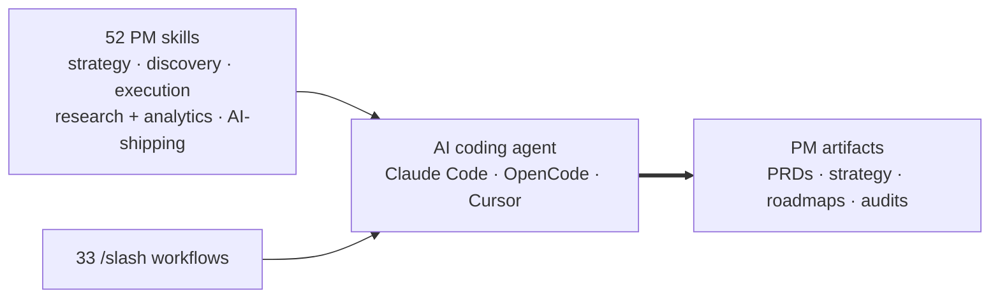

# PM-Cortex-Public

A curated **product-management toolkit for AI coding agents** — a focused set of skills and slash-command workflows that turn an agent (Claude Code, OpenCode, Cursor, …) into a capable PM collaborator: able to produce the artifacts and analyses product work actually runs on.

> **Credit:** The skills and workflows here are a curated subset of [**phuryn/pm-skills**](https://github.com/phuryn/pm-skills) by [Paweł Huryn](https://www.productcompass.pm), MIT-licensed. This repo's contribution is the selection and packaging. See [ATTRIBUTION.md](ATTRIBUTION.md).

## What it covers

- **Strategy & vision** — product strategy canvas, vision, value propositions, SWOT / PESTLE / Porter's Five Forces / Ansoff, lean & business-model & startup canvases, pricing, monetization.
- **Discovery** — opportunity-solution trees, assumption identification & prioritization, idea & experiment design, interview scripts and synthesis, feature-request triage.
- **Execution** — PRDs, user & job stories, prioritization frameworks (RICE / ICE / Kano / MoSCoW…), outcome roadmaps, sprint plans, pre-mortems, strategy red-teaming, stakeholder maps, OKRs, test scenarios.
- **Research & analytics** — personas, segmentation, journey maps, market sizing, competitor analysis & battlecards, North Star metrics, dashboards, cohort & A/B analysis, SQL generation, sentiment analysis.
- **Shipping AI-built products** — auditing what an AI-generated codebase actually does vs. what it's meant to do, plus static security, performance, and test-coverage reviews.

## Contents

- **52 skills** — each a self-contained folder under [`skills/`](skills/) with a `SKILL.md` (Anthropic skill format). Invoked by name through the agent's skill system.
- **33 workflow commands** — `/slash-command` entry points in [`skills/commands/`](skills/commands/) that chain skills into end-to-end flows, e.g. `/write-prd`, `/discover`, `/ship-check`, `/market-scan`.



## Structure

```
skills/            # 52 skill folders, one SKILL.md each
  commands/        # 33 slash-command workflows (.md)
LICENSE            # MIT — original contributions (curation/packaging)
ATTRIBUTION.md     # MIT notice for the upstream pm-skills content
```

## Using it with Claude Code

Skills and slash commands are discovered from your personal config directory:

- **Skills** — make each skill folder discoverable under `~/.claude/skills/<name>/SKILL.md` (symlink/junction it, or copy it).
- **Commands** — copy the workflow `.md` files into `~/.claude/commands/`.

Copy-paste install from a clone of this repo:

**Windows (PowerShell):**

```powershell
git clone https://github.com/mir17881/PM-Cortex-Public.git
New-Item -ItemType Directory -Force "$HOME\.claude\skills", "$HOME\.claude\commands" | Out-Null
Get-ChildItem PM-Cortex-Public\skills -Directory | Where-Object Name -ne 'commands' |
  Copy-Item -Destination "$HOME\.claude\skills\" -Recurse -Force
Copy-Item PM-Cortex-Public\skills\commands\*.md "$HOME\.claude\commands\" -Force
```

**macOS / Linux:**

```bash
git clone https://github.com/mir17881/PM-Cortex-Public.git
mkdir -p ~/.claude/skills ~/.claude/commands
for d in PM-Cortex-Public/skills/*/; do
  [ "$(basename "$d")" = commands ] || cp -R "$d" ~/.claude/skills/
done
cp PM-Cortex-Public/skills/commands/*.md ~/.claude/commands/
```

Then invoke a skill by name, or run a workflow as a slash command:

```
/write-prd SSO support for enterprise customers
/discover onboarding drop-off on step 3
/ship-check
```

Each skill also works standalone — just ask the agent to apply it (e.g. *"run a pre-mortem on this launch plan"*).

## License & credits

- Original contributions (curation, selection, README, structure): MIT — see [LICENSE](LICENSE).
- Underlying skill/workflow content: MIT © 2026 Paweł Huryn — see [ATTRIBUTION.md](ATTRIBUTION.md) and [phuryn/pm-skills](https://github.com/phuryn/pm-skills). If you find these useful, star the upstream project.
